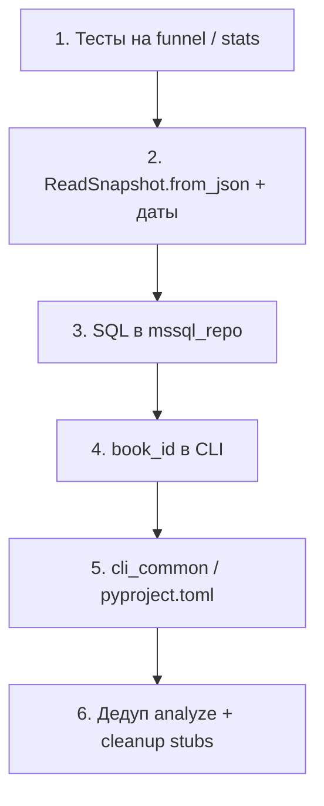

# План рефакторинга AutorToday

Документ фиксирует рекомендации по улучшению кодовой базы (состояние на весну 2026).
Приоритеты: **высокий** → **средний** → **низкий**.

**Перед началом работ** — пакет документов в [`docs/`](docs/README.md): глоссарий, базовая архитектура, контракты данных, известные баги, ADR, стратегия тестов, чеклист по фазам.

---

## Высокий приоритет

### 1. Единое имя: `book_id` vs `work_id` ✅ выполнено (2026-06)

**Статус:** закрыто для Python/CLI/документации. Намеренно без изменений: колонка БД `fetch_runs.work_id`, параметр URL `workId`.

Сейчас одно и то же понятие (author.today `workId`) называется по-разному:

| Слой | Имя | Файлы |
|------|-----|-------|
| БД | `work_id` | `author_today/storage/mssql/schema.sql` — **оставлено** |
| Python / settings | `book_id` | `domain/models.py`, `config/settings.py` (`AT_BOOK_ID` / `AT_WORK_ID` → `book_id`) |
| CLI | `book_id` (+ alias) | `--book-id` везде; `--work-id` — устаревший alias с предупреждением |
| URL сайта | `workId` | `author_today/fetch/stats_url.py` (`build_stats_url(book_id=...)`) |

**Сделано:** `cli.py`, `delete_runs.py`, `stats_url.py`, `.env.example` (`AT_BOOK_ID`), `books.yaml`, README, glossary, data_contracts. См. ADR-001 в [`docs/decisions.md`](docs/decisions.md).

**Не в scope:** переименование колонки SQL (ADR-010).

---

### 2. Централизация SQL для аналитики

Запросы к прочтениям размазаны по:

- `author_today/analyze/funnel.py` — агрегат по главам
- `author_today/analyze/funnel_compare.py` — матрица по дням
- `scripts/delete_runs.py` — удаление по `work_id` + `fetched_at`

**Проблема:** изменение схемы (`chapter_order`, фильтры по датам) требует правок в нескольких местах. Analyze обходит `ReadRepository`. В `delete_runs.py` SQL собирается через f-строки с дублированием подзапросов.

**Рекомендация:** добавить в `author_today/storage/mssql_repo.py` (или `storage/mssql/queries.py`):

- `aggregate_chapter_views(book_id, period_start, period_end)`
- `daily_chapter_matrix(book_id, period_start, period_end)`
- `delete_runs_by_fetched_at(work_id, fetched_from, fetched_to, dry_run=False)`

`funnel.py`, `funnel_compare.py`, `delete_runs.py` — только вызывают репозиторий.

---

### 3. Единый путь загрузки JSON через `ReadSnapshot`

Два парсера читают один формат JSON по-разному:

- `funnel_from_json()` в `funnel.py` — агрегация по **имени** главы, `chapter_order` = порядок первого появления
- `daily_matrix_from_json()` в `funnel_compare.py` — матрица по дням, `order = idx + 1` внутри дня

Из MSSQL берётся настоящий `chapter_order` (как на сайте, через `mssql_repo._chapter_rows`).

**Проблема:** воронка из JSON и из БД может расходиться. Нет общего `ReadSnapshot.from_json_file()`.

**Рекомендация:**

- `ReadSnapshot.from_json(path)` в `author_today/domain/models.py`
- воронка и сравнение периодов строятся от одной модели
- использовать уже существующий `funnel_from_snapshot()` как канонический путь для JSON

---

### 4. Автотесты (сейчас отсутствуют)

- В проекте нет `test_*.py`, pytest, unittest
- `author_today/analyze/stats_test.py` — **продакшен-код** (Welch t-test), не тестовый модуль; имя вводит в заблуждение

**Приоритетные цели для тестов:**

- `build_funnel()`, `compare_funnel_periods()` — чистая логика
- `mean_and_sigma()`, `welch_ttest_pvalue()` — оба пути (scipy и fallback)
- `split_period_into_months()` в `author_today/fetch/periods.py`
- `ReadSnapshot.from_stats_table()` — парсинг дат
- golden-file: JSON → funnel CSV

---

### 5. Баг: даты через границу года

В `ReadSnapshot.from_stats_table` всем заголовкам `DD.MM` подставляется `period_end.year`:

```python
year = period_end.year
parsed_dates = tuple(
    date(year, int(d.split(".")[1]), int(d.split(".")[0])) for d in table.dates
)
```

**Проблема:** период `2025-12-01` — `2026-01-31` даст неверные даты для декабря.

**Рекомендация:** вывод года по контексту `period_start` / `period_end` (инкремент при «откате» месяца). Тест на cross-year период.

---

### 6. Загрузка за несколько месяцев: только последний chunk в CSV/JSON

В `sync_reads_by_period` при разбиении по месяцам (`len(chunks) > 1`) в `output_csv` / `output_json` попадают данные **только последнего** месяца; в БД и `data/raw` сохраняются все chunks.

**Рекомендация:** либо `merge_stats_tables()` по chunks, либо явно запретить/предупреждать про `-o`/`--json` при периоде > 1 месяца.

---

## Средний приоритет

### 7. Общий CLI и bootstrap скриптов

Шесть скриптов в `scripts/` повторяют:

```python
ROOT = Path(__file__).resolve().parent.parent
if str(ROOT) not in sys.path:
    sys.path.insert(0, str(ROOT))
```

Дублируются аргументы между `report_funnel.py` и `report_funnel_compare.py`:

- `--book-id`, `--start` / `--end`, `--skip-book-page`, `--base-order`, `--csv`
- `Settings.from_env()` + выбор JSON vs MSSQL
- `except ValueError` → stderr → exit 1

**Рекомендация:**

- `author_today/cli_common.py` с `add_book_period_args()`, `add_funnel_args()`, `resolve_book_id()`
- или подкоманды в `author_today/cli.py`:

  ```bat
  python -m author_today funnel ...
  python -m author_today funnel-compare ...
  python -m author_today delete-runs ...
  ```

- `pyproject.toml` + `pip install -e .` — убрать хак с `sys.path`

---

### 8. Дедупликация модуля `analyze/`

| Общее | `funnel.py` | `funnel_compare.py` |
|-------|-------------|---------------------|
| Фильтр «Страница книги» | inline | `_is_book_page()` |
| Расчёт % | `_pct()` | inline |
| CSV decimal | `_fmt_decimal(places=1)` | `_fmt_decimal(places=2)` |
| MSSQL | `funnel_from_mssql` | `daily_matrix_from_mssql` |
| JSON | `funnel_from_json` | `daily_matrix_from_json` |

**Рекомендация:** выделить:

- `author_today/analyze/chapter_filters.py` — `is_book_page()`, `filter_chapters()`
- `author_today/analyze/formatting.py` — `fmt_decimal_ru()`, `pct()`
- `author_today/analyze/snapshot_loaders.py` — JSON/MSSQL → `ReadSnapshot` / `DailyMatrix`

`funnel.py` и `funnel_compare.py` оставить тонкими оркестраторами.

Переименовать `stats_test.py` → `stats.py` или `hypothesis_tests.py`.

---

### 9. `ReadRepository` — использовать или убрать

- Protocol в `author_today/storage/base.py`
- `MssqlReadRepository` не объявляет реализацию; `list_runs` с `limit` не в Protocol
- `SqliteReadRepository` — заглушка с `NotImplementedError`
- `persist.py` вызывает `create_mssql_repository()` напрямую

**Рекомендация:** фабрика `get_repository(settings)` через Protocol, либо удалить Protocol/SQLite до реальной необходимости.

---

### 10. Единообразная обработка ошибок

| Точка входа | Ловит |
|-------------|-------|
| `author_today/cli.py` | `TimeoutException`, `RuntimeError`, `NotImplementedError` |
| `scripts/report_funnel*.py` | только `ValueError` |
| `scripts/delete_runs.py` | `ValueError` для дат |
| `scripts/init_mssql.py` | ничего |

Ошибки `pyodbc` в скриптах — сырой traceback.

**Рекомендация:** `author_today/errors.py` (`ConfigError`, `DataNotFoundError`, `AuthError`); на границе storage — `pyodbc.Error` → доменные исключения.

---

### 11. Неиспользуемая конфигурация и пути

- `config/books.yaml` — `work_id` + `title`, нигде не загружается
- `data/reports` захардкожен в `funnel.py` и `report_funnel_compare.py`; в `settings.py` есть `DATA_DIR` / `RAW_DIR`, но нет `REPORTS_DIR`

**Рекомендация:** подключить `books.yaml` в settings или удалить файл; добавить `REPORTS_DIR = DATA_DIR / "reports"`.

---

### 12. Опциональный `scipy`

`welch_ttest_pvalue()` пробует `scipy.stats.ttest_ind`, иначе ~150 строк ручной реализации. `scipy` не в `requirements.txt`.

**Рекомендация:** `requirements-analytics.txt` с `scipy` или unit-тесты, что fallback и scipy дают близкие p-value на эталонных выборках.

---

## Низкий приоритет

### 13. Тонкие entry points (можно оставить)

| Файл | Оборачивает |
|------|-------------|
| `selenium_stats.py` | `author_today.cli.main` |
| `scripts/fetch_reads.py` | `author_today.cli.main` |
| `author_today/fetch/stats_page.py` | `parse_stats_page()` |
| `persist.py::snapshot_from_table` | one-liner вокруг `ReadSnapshot.from_stats_table` |

Дублирование `selenium_stats.py` / `fetch_reads.py` — осознанная обратная совместимость.

---

### 14. Заглушки и неиспользуемый код

| Файл | Статус |
|------|--------|
| `scripts/report.py` | placeholder |
| `author_today/storage/sqlite_repo.py` | `NotImplementedError` |
| `author_today/analyze/reads.py` | минимальные сводки, только из `report.py` |
| `author_today/analyze/sales.py` | `load_sales_csv()` не вызывается из основного кода |
| `author_today/fetch/stats_url.py::parse_period_from_url` | TODO, возвращает `(None, None)` |

**Рекомендация:** реализовать или убрать; не экспортировать мёртвый API из `analyze/__init__.py`.

---

### 15. Дублирование обхода строк прочтений

`MssqlReadRepository._chapter_rows()` и `ReadSnapshot.to_document()` по-разному итерируют `(dates × chapters)`.

**Рекомендация:** `ReadSnapshot.iter_read_rows()` → `(read_date, chapter_order, chapter_name, views)` для JSON export и MSSQL insert.

---

### 16. Лишняя сериализация в `persist_snapshot`

```python
rows_count = sum(len(day["chapters"]) for day in snapshot.to_document()["dates"])
```

**Рекомендация:** `len(snapshot.dates) * len(snapshot.chapters)` или общий итератор из п. 15.

---

### 17. README и структура пакета

README описывает `analyze/` как «сводки и reclan.csv», тогда как основная фича — funnel compare. `legacy/` — архив, не смешивать с пакетом.

**Рекомендация:** обновить раздел «Структура» в README после рефакторинга.

---

## Рекомендуемый порядок работ



1. **Тесты** — страховка перед изменением логики
2. **Единый snapshot** — устраняет расхождения JSON vs MSSQL
3. **SQL в storage** — проще сопровождать схему
4. **Именование** — дёшево, сразу меньше путаницы
5. **CLI** — когда отчётов станет больше
6. **Заглушки и README** — по мере сил

---

## Что не трогать пока

- `legacy/` — архив экспериментов
- Тонкие entry points (`selenium_stats.py`) — нормально для UX
- Переименование колонки `work_id` в БД — только при готовности к миграции

---

## Быстрая ссылка на ключевые файлы

| Область | Пути |
|---------|------|
| Domain | `author_today/domain/models.py` |
| CLI | `author_today/cli.py` |
| Pipeline | `author_today/pipeline/sync_reads.py` |
| Analyze | `author_today/analyze/funnel.py`, `funnel_compare.py`, `stats_test.py` |
| Storage | `author_today/storage/mssql_repo.py`, `persist.py`, `mssql/schema.sql` |
| Scripts | `scripts/report_funnel.py`, `report_funnel_compare.py`, `delete_runs.py` |
| Config | `config/settings.py`, `books.yaml` |
| Tests | **нет** (задача на создание) |
