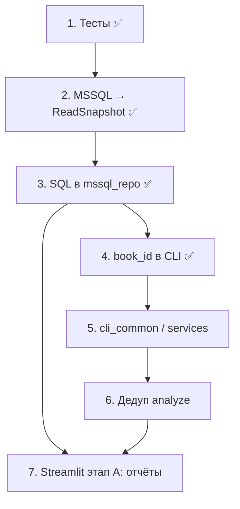

# План рефакторинга AuthorToday

Документ фиксирует рекомендации по улучшению кодовой базы (состояние на весну 2026).
Приоритеты: **высокий** → **средний** → **низкий**.

**Перед началом работ** — пакет документов в [`docs/`](docs/README.md): глоссарий, базовая архитектура, контракты данных, известные баги, ADR, стратегия тестов, чеклист по фазам.

---

## Высокий приоритет

### 1. Единое имя: `book_id` vs `work_id` ✅ выполнено (2026-06)

**Статус:** закрыто для Python/CLI/документации. Намеренно без изменений: колонка БД `fetch_runs.work_id`, параметр URL `workId`.

Сейчас одно и то же понятие (author.today `workId`) называется по-разному:

| Слой | Имя | Файлы |
|------|-----|-------|
| БД | `work_id` | `author_today/storage/mssql/schema.sql` — **оставлено** |
| Python / settings | `book_id` | `domain/models.py`, `config/settings.py` (`AT_BOOK_ID` / `AT_WORK_ID` → `book_id`) |
| CLI | `book_id` (+ alias) | `--book-id` везде; `--work-id` — устаревший alias с предупреждением |
| URL сайта | `workId` | `author_today/fetch/stats_url.py` (`build_stats_url(book_id=...)`) |

**Сделано:** `cli.py`, `delete_runs.py`, `stats_url.py`, `.env.example` (`AT_BOOK_ID`), `books.yaml`, README, glossary, data_contracts. См. ADR-001 в [`docs/decisions.md`](docs/decisions.md).

**Не в scope:** переименование колонки SQL (ADR-010).

---

### 2. Централизация SQL для аналитики ✅

Запросы к прочтениям размазаны по:

- `author_today/analyze/funnel.py` — агрегат по главам
- `author_today/analyze/funnel_compare.py` — матрица по дням
- `scripts/delete_runs.py` — удаление по `work_id` + `fetched_at`

**Проблема:** изменение схемы (`chapter_order`, фильтры по датам) требует правок в нескольких местах. Analyze обходит `ReadRepository`. В `delete_runs.py` SQL собирается через f-строки с дублированием подзапросов.

**Рекомендация:** добавить в `author_today/storage/mssql_repo.py` (или `storage/mssql/queries.py`):

- `aggregate_chapter_views(book_id, period_start, period_end)`
- `daily_chapter_matrix(book_id, period_start, period_end)`
- `delete_runs_by_fetched_at(work_id, fetched_from, fetched_to, dry_run=False)`

`funnel.py`, `funnel_compare.py`, `delete_runs.py` — только вызывают репозиторий.

---

### 3. Единая доменная модель: MS SQL → `ReadSnapshot` ✅

**Источник правды — MS SQL** (ADR-012). JSON в `data/raw/` — legacy, скрыт из UI/CLI; удаление кода — позже.

Целевой поток отчётов:

```
mssql_repo.load_snapshot(...) ──► ReadSnapshot ──► funnel / compare
```

**Реализовано:** `load_snapshot`, `ReadSnapshot.from_json`, `chapter_totals()` / `daily_matrix()`, cross-year в `parse_dd_mm_columns`.

---

### 4. Автотесты ✅

pytest + фикстуры; `stats_test.py` переименован в `hypothesis_tests.py` (ADR-006).
---

### 5. Баг: даты через границу года ✅

Исправлено в `parse_dd_mm_columns()` (`author_today/domain/models.py`).

---

### 6. Загрузка за несколько месяцев: только последний chunk в CSV/JSON ✅ (2026-07)

В `sync_reads_by_period` при разбиении по месяцам (`len(chunks) > 1`) в `output_csv` / `output_json` попадают данные **только последнего** месяца; в БД и `data/raw` (автосохранение) сохраняются все chunks.

**Сделано:** предупреждение в stderr при `-o` / `--json` (ADR-005, вариант C). Merge в один файл — опционально позже (вариант A).

---

## Средний приоритет

### 7. Общий CLI и bootstrap скриптов ✅ (2026-07)

**Сделано:**
- `pyproject.toml` + `pip install -e .`; хак `sys.path.insert` убран из `scripts/`
- `author_today/cli_common.py` — `add_book_id_arg`, `add_period_args`, `add_funnel_filter_args`,
  `add_csv_output_arg`, `resolve_book_id`, `require_mssql` / `require_legacy_json`
- `report_funnel.py` и `report_funnel_compare.py` используют хелперы

**Опционально позже:** подкоманды `python -m author_today funnel|funnel-compare|delete-runs`.

---

### 8. Дедупликация модуля `analyze/` ✅ (2026-07)

**Сделано:**
- `author_today/analyze/chapter_filters.py` — `is_book_page()`, `filter_chapter_rows()`
- `author_today/analyze/formatting.py` — `pct()`, `pct_column_label()`, `fmt_decimal_ru()`, `fmt_pvalue()`
- `stats_test.py` → `hypothesis_tests.py` (ADR-006)

`funnel.py` и `funnel_compare.py` используют общие модули.

**Опционально позже:** `snapshot_loaders.py` (JSON/MSSQL → snapshot уже тонкие обёртки).
---

### 9. `ReadRepository` — использовать или убрать

- Protocol в `author_today/storage/base.py`
- `MssqlReadRepository` не объявляет реализацию; `list_runs` с `limit` не в Protocol
- `SqliteReadRepository` — удалён (2026-07); источник правды — MS SQL
- `persist.py` вызывает `create_mssql_repository()` напрямую

**Рекомендация:** фабрика `get_repository(settings)` через Protocol, либо удалить Protocol/SQLite до реальной необходимости.

---

### 10. Единообразная обработка ошибок

| Точка входа | Ловит |
|-------------|-------|
| `author_today/cli.py` | `TimeoutException`, `RuntimeError`, `NotImplementedError` |
| `scripts/report_funnel*.py` | только `ValueError` |
| `scripts/delete_runs.py` | `ValueError` для дат |
| `scripts/init_mssql.py` | ничего |

Ошибки `pyodbc` в скриптах — сырой traceback.

**Рекомендация:** `author_today/errors.py` (`ConfigError`, `DataNotFoundError`, `AuthError`); на границе storage — `pyodbc.Error` → доменные исключения.

---

### 11. Неиспользуемая конфигурация и пути

- `config/books.yaml` — `work_id` + `title`, нигде не загружается
- `data/reports` захардкожен в `funnel.py` и `report_funnel_compare.py`; в `settings.py` есть `DATA_DIR` / `RAW_DIR`, но нет `REPORTS_DIR`

**Рекомендация:** подключить `books.yaml` в settings или удалить файл; добавить `REPORTS_DIR = DATA_DIR / "reports"`.

---

### 12. Опциональный `scipy`

`welch_ttest_pvalue()` пробует `scipy.stats.ttest_ind`, иначе ~150 строк ручной реализации. `scipy` не в `requirements.txt`.

**Рекомендация:** `requirements-analytics.txt` с `scipy` или unit-тесты, что fallback и scipy дают близкие p-value на эталонных выборках.

---

## Низкий приоритет

### 13. Тонкие entry points (можно оставить)

| Файл | Оборачивает |
|------|-------------|
| `selenium_stats.py` | `author_today.cli.main` |
| `scripts/fetch_reads.py` | `author_today.cli.main` |
| `author_today/fetch/stats_page.py` | `parse_stats_page()` |
| `persist.py::snapshot_from_table` | one-liner вокруг `ReadSnapshot.from_stats_table` |

Дублирование `selenium_stats.py` / `fetch_reads.py` — осознанная обратная совместимость.

---

### 14. Заглушки и неиспользуемый код ✅ удалены (2026-07)

Удалены: `scripts/report.py`, `storage/sqlite_repo.py`, `analyze/sales.py`, `analyze/reads.py`.

`parse_period_from_url` — TODO, возвращает `(None, None)` (низкий приоритет).

---

### 15. Дублирование обхода строк прочтений

`MssqlReadRepository._chapter_rows()` и `ReadSnapshot.to_document()` по-разному итерируют `(dates × chapters)`.

**Рекомендация:** `ReadSnapshot.iter_read_rows()` → `(read_date, chapter_order, chapter_name, views)` для JSON export и MSSQL insert.

---

### 16. Лишняя сериализация в `persist_snapshot`

```python
rows_count = sum(len(day["chapters"]) for day in snapshot.to_document()["dates"])
```

**Рекомендация:** `len(snapshot.dates) * len(snapshot.chapters)` или общий итератор из п. 15.

---

### 17. README и структура пакета ✅ (2026-07)

Раздел «Структура» обновлён: funnel/compare, services, cli_common; заглушки убраны из описания.

---

## Средний приоритет (продолжение)

### 18. Веб-интерфейс (Streamlit) 🚧 подготовлено

**Статус:** каркас готов; рабочие экраны отчётов — этап A (§2–§3 ✅).

| Компонент | Путь | Статус |
|-----------|------|--------|
| Зависимости | `requirements-ui.txt` | ✅ |
| Точка входа | `streamlit_app.py` | ✅ заглушка (tabs) |
| Конфиг | `.streamlit/config.toml` | ✅ |
| Сервисный слой | `author_today/services/reports.py` | ✅ |
| Документация | `docs/ui_streamlit.md` | ✅ |
| Отчёты в UI | воронка, compare, графики | ⏳ этап A |
| Загрузка Selenium | фоновая задача | ⏳ этап C |

**Правила:** UI → `services/` → `analyze/` / `storage/`; без `subprocess` на scripts; без SQL в `streamlit_app.py`.

**Не делать:** Django, дублирование `scripts/report_*.py` в кнопках.

Подробно: [`docs/ui_streamlit.md`](docs/ui_streamlit.md), ADR-011.

---

## Рекомендуемый порядок работ



1. **Тесты** — ✅ сделано
2. **MSSQL → ReadSnapshot** — ✅ сделано (п. 3)
3. **SQL в storage** — ✅ сделано (п. 2)
4. **Именование** — ✅ сделано (п. 1)
5. **CLI / services** — `pip install -e .` ✅; `cli_common` ✅; `services/` под Streamlit ✅
6. **Заглушки и README** — stubs удалены ✅; README обновлён ✅
7. **Streamlit** — каркас ✅; отчёты в UI — этап A (§2–§3 готовы)

---

## Что не трогать пока

- `legacy/` — архив экспериментов
- Тонкие entry points (`selenium_stats.py`) — нормально для UX
- Переименование колонки `work_id` в БД — только при готовности к миграции

---

## Быстрая ссылка на ключевые файлы

| Область | Пути |
|---------|------|
| Domain | `author_today/domain/models.py` |
| CLI | `author_today/cli.py` |
| Pipeline | `author_today/pipeline/sync_reads.py` |
| Analyze | `author_today/analyze/funnel.py`, `funnel_compare.py`, `hypothesis_tests.py`, `formatting.py`, `chapter_filters.py` |
| Storage | `author_today/storage/mssql_repo.py`, `persist.py`, `mssql/schema.sql` |
| Scripts | `scripts/report_funnel.py`, `report_funnel_compare.py`, `delete_runs.py` |
| Config | `config/settings.py`, `books.yaml` |
| UI | `streamlit_app.py`, `author_today/services/`, `docs/ui_streamlit.md` |
| Tests | `tests/` (pytest) |
